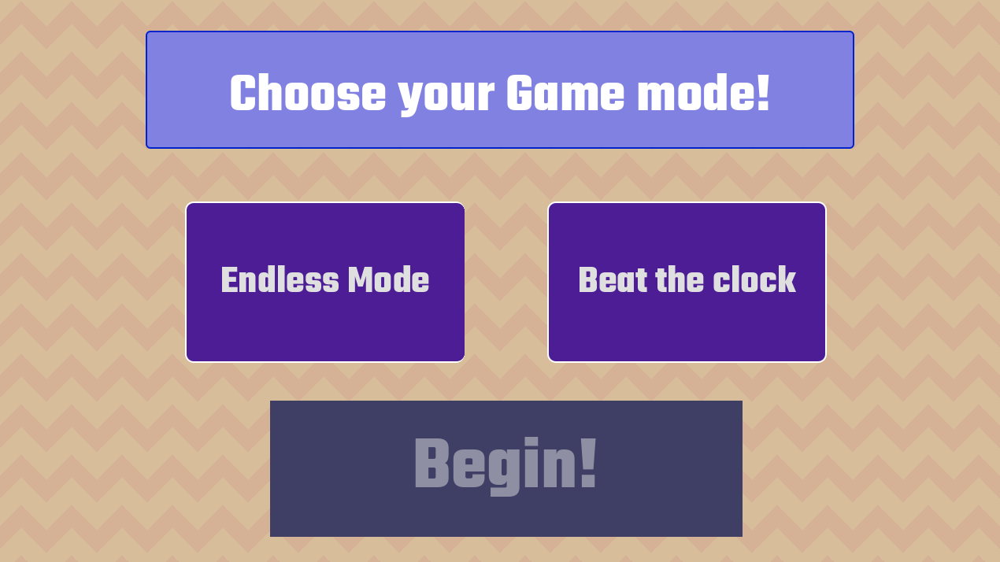
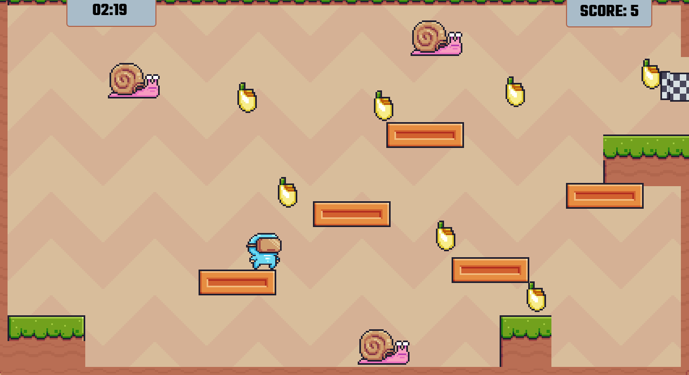

# Creep and Collect

Creep and Collect was made as an entry to Hack Club -> Athena -> Sleepover -> SnoozeFest game jam. This game was made using godot and published on itch.io. Play it [here:](https://hack-girl.itch.io/dash) https://hack-girl.itch.io/dash

I lowk cooked. I added different levels and a game menu. You can pick between a timer mode and a non-timer mode.
Do you like my song? It's South African. It's [Ngishutheni, by a bunch of people!](https://open.spotify.com/intl-es/track/3JW9hNUjUN51X9jZyn2HVV?si=f1c0f148d07b44fb)

Lowk, this was my first game. I'm not SOOOOO into Game Dev, but I love building different kindsastuff.

## Aim of the game
You need to collect all bananas, without waking the snails up (by bumping into them) to win.

## How to Play

- Move left and right with A/left arrow and D/right arrow
- Jump with W / Enter key / Space bar / up arrow key
- Bump into bananas to collect them
- If you wake up the snails, you loose!
- Collect all bananas to win the game :)

## ASSETS CREDIT!!
[Pixel adventure Spreadsheet](https://pixelfrog-assets.itch.io/pixel-adventure-1)
You can download a folder that contains the assets I used and more!

[Play Creep & Collect here](https://hack-girl.itch.io/dash)